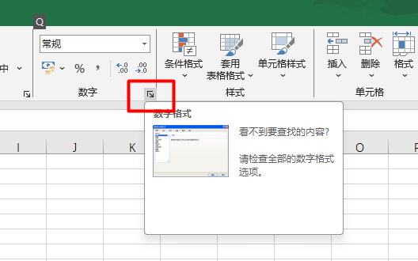
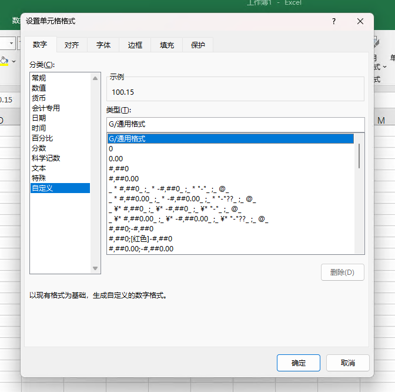

# Excel 自定义单元格格式

查看自定义单元格格式示例，请转到 “数字” -> “设置单元格格式” -> “自定义”分类

## 1. “G/通用格式”：以常规的数字显示，相当于“分类”列表中的“常规”选项。

代码：“G/通用格式”。10显示为10;10.1显示为10.1。

## 2. “0”：数字占位符。

如果单元格的内容大于占位符，则显示实际数字，如果小于点位符的数量，则用0补足。

例：代码：“00000”。1234567显示为1234567;123显示为00123

代码：“00.000”。100.14显示为100.140;1.1显示为01.100

## 3. “#”：数字占位符。

只显有意义的零而不显示无意义的零。小数点后数字如大于“#”的数量，则按“#”的位数四舍五入。

例：代码：“###.##”,12.1显示为12.10;12.1263显示为：12.13

## 4. “?”：数字占位符。

在小数点两边为无意义的零添加空格，以便当按固定宽度时，小数点可对齐，另外还用于对不等到长数字的分数。

例：代码：分别设置单元格格式为“??.??“和“???.???”,对齐结果为以小数点对齐。

代码：设置单元格自定义格式“# ??/???”。“1.25”显示为数学上的1又4分之1的写法。

## 5. “.”：小数点。

如果外加双引号则为字符。

例：代码：“0.#”。“11.23”显示为“11.2”

## 6. “%”：百分比。

例：代码：“#%”。“0.1”显示为“10%”

## 7. “，”：千位分隔符。

数字使用千位分隔符。如时在代码中“，”后空，则把原来的数字缩小1000倍。

例：代码：“#，###”。“10000”显示为“10，000”

代码：“#，”。10000显示为10。

代码：“#，，”。“1000000”显示为“1”。

## 8. ”@”：文本占位符。

如果只使用单个@，作用是引用原始文本，要在输入数字数据之前自动添加文本，使用自定义格式为："文本内容"@;要在输入数字数据之后自动添加文本，使用自定义格式为：@"文本内容"。@符号的位置决定了Excel输入的数字数据相对于添加文本的位置。如果使用多个@，则可以重复文本。

例：代码："集团"@"部"财务 显示为：集团财务部

代码："@@@"，财务 显示为：财务财务财务

## 9. “/”：显示下一个字符。

和“”””用途相同都是显是输入的文本，且输入后会自动转变为双引号表达。不同的“/”是显后面的文本，双引号是显示双引中间的文本。

例：代码：“\ABC”或“”ABC””。均显示为“ABC”

代码："@@@"，财务 显示为：财务财务财务

1## 0. “*”：重复下一次字符，直到充满列宽。

例：代码：“@*-”。“ABC”显示为“ABC-------------------”

1## 1. “_”：下划线。

留下一个和下一个字符同等宽度的空格“文本”：显示双引号中的文本。

例：代码：“”中国”@”显示为“中国河南”

1## 2. 【颜色】：用指定的颜色显示字符。

可有八种颜色可选：红色、黑色、黄色，绿色、白色、兰色、青色和洋红。

例：代码：“[青色];[红色];[黄色];[兰色]”。显示结果为正数为青色，负数显示红色，零显示黄色，文本则显示为兰色

1## 3. 【颜色N】：调用调色板中的颜色，N是0--56之间的整数。

例：代码：“[颜色3]”。单元格显示的颜色为调色板上第3种颜色。

1## 4. 【条件】：根据单元格内容判断后再设置格式。

条件格式化只限于使用三个条件，其中两个条件是明确的，另个是“所有的其他”。条件要放到方括号中。必须进行简单的比较。

例：代码：“[>0]”正数”;[=0];”零”;负数”。显示结果是单元格数值大于零显示正数，等于0显示零，小于零显示“负数”。

1## 5. “！”：显示“"”

由于引号是代码常用的符号。在单元格中是无法用"""来显示出来“"”。要想显示出来，须在前加入“!”

代码：“#!"”。“10”显示“10"”

代码：“#!"!"”。“10”显示“10""”

1## 6. 时间和日期代码

代码：“YYYY”或“YY”：按四位(1900~9999)或两位(00~99)显示年

“MM”或“M”：以两位(01~12)或一位(1~12)表示月。

“DD”或“D”：以两位(01~31)或一位(1-31)来表示天。

例：代码：“YYYY-MM-DD”。2005年1月10日显示为：“2005-01-10”

代码：“YY-M-D”。2005年10月10日显示为：“05-1-10”

代码：“AAAA”：日期显示为星期。

代码：“H”或“HH”：以一位(0~23)或两位(01~23)显示小时

代码：“M”或“MM”：以一位(0~59)或两位(01~59)显示分钟

代码：“S”或“SS”：以一位(0~59)或两位(01~59)显示秒

代码：“HH:MM:SS”。“23:1:15”显示为“23:01:15”

或：显示大于24小时的小时或显示大于60的分或秒。