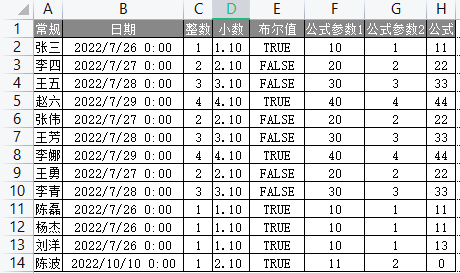
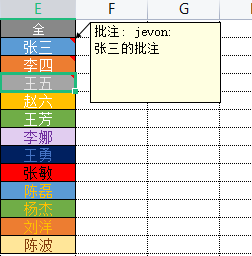
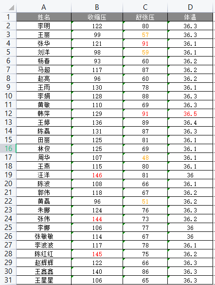

# ExcelPatternTool

开箱即用的Excel工具包。
Excel数据校验，数据导入，以及自定义样式填充数据导出到Excel文档。

## 功能
可设置列属性，包括样式，公式，注解；
可配置规则独立设置单元格样式；
可配置规则对Excel校验，包括数值校验和公式校验，内置Lambda表达式和正则表达式两个预设的校验器；
可扩展的接口封装和组件。

## 特点：
提供独立Excel校验工具；
提供Cli版本和带UI（WPF）版本的程序；
提供ODBC扩展；
基于json文件或类型+成员属性（Attribute）的配置方式。


## 快速开始

在项目中引用[ExcelPatternTool.Core]( https://www.nuget.org/packages/ExcelPatternTool.Core)


```
dotnet add package ExcelPatternTool.Core
```

从Excel导入
```
Importer import = new Importer();
import.LoadXlsx(File.ReadAllBytes(filePath));   //导入xlsx文件
// or
import.LoadXls(File.ReadAllBytes(filePath));    //或导入xls文件
var importOption = new ImportOption<T>(0, 0);
var result = import.Process<T>(importOption).ToList()

Console.WriteLine(result);      //导入完成！

```

导出Excel
```
IList<T> src = ...  //准备数据


Exporter exporter = new Exporter();
exporter.DumpXlsx(filePath);    //导出xlsx文件
// or
exporter.DumpXls(filePath);     //或导出xls文件
var exportOption = new ExportOption<T>(0);
var issuccess = exporter.Process(src, exportOption); //导出完成！
```

## 使用说明

编辑你的C#类，此类将作为ExcelPatternTool导入导出功能的承载实体类型，继承自`IExcelEntity`

### 常规类型 

常规类型是C#基本数据类型，直接输出的为单元格值

可定义 `string`， `DateTime`，`int`，`double`，`bool`

### 高级类型

使用高级类型导入时不光读取数据，还将读取单元格细节，导出至Excel时，将保留这些细节。

高级类型是继承自IAdvancedType的类，往往是一个泛型，它的类型参数为常规类型，对应实际的单元格值。

高级类型有："包含注解"，"包含样式"，"包含公式"，"全包含"类型。

1. ICommentedType: 包含单元格注解；
2. IStyledType: 包含单元格样式；
3. IFormulatedType: 包含单元格公式的对象；
4. IFullAdvancedType: 包含了单元格注解，样式，公式。


### Importable注解
1. Order 列序号为此列在Excel中的编号，从0开始，即A列对应0，B列对应1 ...

2. Ignore 为True时将忽略这一列，等效于ExcelEntity无此属性

### Exportable注解
1. Order 列序号为此列在Excel中的编号，从0开始，即A列对应0，B列对应1 ...

2. Name 列名称，将指定导出时的该列第一行名称

3. Ignore 为True时将忽略这一列，等效于ExcelEntity无此属性

4. Format 指定单元格格式，格式约定请参考[Excel 自定义单元格格式](./Assets/format.md)

5. Type: 单元格类型， Exportable中可指定Type类型的为

    |    值     |  含义  |
    | :-------: | :----: |
    |   `Any`   | 自定义 |
    |  `Text`   |  文本  |
    | `Numeric` |  数值  |
    |  `Date`   |  时间  |
    |  `Bool`   | 布尔值 |
  
    若不指定则根据属性类型自动判断


### IImportOption导入选项

1. EntityType 指定一个实体类型，将使用此类型中的属性作为导入列
2. SheetName 指定导入的Sheet名称，若不指定将导入第SheetNumber个Sheet
3. SheetNumber 指定导入的Sheet编号，从0开始。
4. SkipRows 指定跳过的行数，从0开始。


### IExportOption导出选项

1. EntityType 指定一个实体类型，将使用此类型中的属性作为导出列
2. SheetName 指定导出的Sheet名称，默认`Sheet1`
3. SkipRows 指定跳过的行数，从0开始。
4. GenHeaderRow 指定是否生成表头行，默认为False
5. StyleMapperProvider 指定样式映射器类型

### 单元格样式

样式支持文字颜色、背景颜色、边框颜色、字体、字号、加粗、下划线、斜体、删除线等。
填充规则支持全局样式，列样式，以及根据样式映射器的规则填充单元格独立样式。


单元格通过StyleMetadata样式元数据定义样式，样式元数据包括：
1. FontColor 字体颜色
2. FontName 字体名称
3. FontSize 字体大小（单位px）
4. BorderColor 边框颜色
5. BackColor 背景颜色
6. IsItalic 是否斜体
7. IsBold 是否加粗
8. IsStrikeout 是否删除线
9. FontUnderlineType 下划线类型
10. FontSuperScript 上标下标


### StyleMapping样式映射

样式映射器用于将实体类型属性映射为单元格样式，可自定义实现，也可使用内置的样式映射器。

1. Target 指定样式映射的目标属性，可选Value单元格值或Formula单元格公式
2. Convention 指定规则，默认的规则有`LambdaExpression`和`RegularExpression`，分别对应Lambda表达式和正则表达式
3. Expression 指定表达式内容
4. MappingConfig 指定表达式结果对应的样式元数据

自定义样式：
通过继承StyleMapperProvider类，重写GetStyleMappingContainers方法，返回的字典称之为`样式映射容器`，作用是将规则对应的数值与样式一一对应。

下面例子说明当“体温”列中的数据超过36.5时，将字体颜色设置为红色，否则为黑色。
```
public override Dictionary<string, StyleMapping> GetStyleMappingContainers()
{
    return new Dictionary<string, StyleMapping>
    {
        "体温",
        new StyleMapping()
        {
            Target = Target.Value,
            Convention = "LambdaExpression",
            Expression = "{value}>36.5",
            MappingConfig = new Dictionary<object, StyleMetadata>
            {
                { true, new StyleMetadata(){  FontColor="Red"} } ,
                { false, new StyleMetadata(){  FontColor="Black"} }
            }
        }
    }
    
}
```


创建后将导出选项的StyleMapperProvider指定为该样式映射器类型

### 使用数据库作为数据源

1. 若涉及数据库导入导出，请使用`Table`标签指定表名称， 使用`Key`标签指定主键类型，无键实体类型请使用`Keyless`
详情请参考EFCore官方文档https://docs.microsoft.com/zh-cn/ef/core/modeling/

## 示例
### Sample1：不同类型字段导出

假设某类中有如下字段
```
public class WriteRowTestEntity : IExcelEntity
{
    [Exportable(ignore: true)]
    public long RowNumber { get; set; }

    [Exportable("日期", Order = 1, Format = "yyyy\"年\"m\"月\"d\"日\";@")]
    public DateTime DateTimeValue { get; set; }

    [Exportable("整数", Order = 2)]
    public int IntValue { get; set; }

    [Exportable("小数", Order = 3)]
    public double DoubleValue { get; set; }

    [Exportable("布尔值", Order = 4)]
    public bool BoolValue { get; set; }

    [Exportable("公式", Order = 7)]
    public FormulatedType<int> IntWithFormula { get; set; }
}
```

导出时日期按照给定格式生成，整数、小数、布尔值根据类型自动判断，公式将导出公式内容。





### Sample2：高级类型导入和导出

假设某类中有如下字段
```
    public class AdvancedTypeTestEntity : IExcelEntity
    {

        [Exportable(ignore: true)]
        [Importable(ignore: true)]
        public long RowNumber { get; set; }

        [Exportable("全", Order = 4)]
        [Importable(0)]
        public FullAdvancedType<string> StringWithFullValue { get; set; }
    }
```

StringWithFullValue将在导入时存储单元格的注解，样式，公式，以及值。导出时按照原样导出。




### Sample3：员工健康体检

假设某类中有如下字段
```
    public class EmployeeHealthEntity : IExcelEntity
    {


        [Exportable(Ignore = true)]
        public long RowNumber { get; set; }

        [Importable(0)]
        [Exportable("姓名")]
        public string ClientName { get; set; }

        [Importable(1)]
        [Exportable("收缩压")]
        public string BloodPressure2 { get; set; }

        [Importable(2)]
        [Exportable("舒张压")]
        public string BloodPressure1 { get; set; }

        [Importable(3)]
        [Exportable("体温")]
        public string Temperature { get; set; }

    }
```


自定义样式映射器EmployeeHealthEntityStyleMapperProvider类，重写获取样式容器GetStyleMappingContainers方法，

内容如下：
```
public class EmployeeHealthEntityStyleMapperProvider : StyleMapperProvider
{
    public override Dictionary<string, StyleMapping> GetStyleMappingContainers()
    {
        var result = new Dictionary<string, StyleMapping>
        {
            {
                "体温",
                new StyleMapping()
                {
                    Target = Target.Value,
                    Convention = "LambdaExpression",
                    Expression = "{value}>=36.5",
                    MappingConfig = new Dictionary<object, StyleMetadata>
                    {
                        { true, new StyleMetadata(){  FontColor="Red"} } ,
                        { false, new StyleMetadata(){  FontColor="Black"} }
                    }
                }
            },
                {
                "收缩压",
                new StyleMapping()
                {
                    Target = Target.Value,
                    Convention = "BloodPressureResultExpression",
                    MappingConfig = new Dictionary<object, StyleMetadata>
                    {
                        { "偏低异常", new StyleMetadata(){  FontColor="Orange"} } ,
                        { "偏高异常", new StyleMetadata(){  FontColor="Red"} },
                        { "正常", new StyleMetadata(){  FontColor="Black"} }
                    }
                }

            },
                {
                "舒张压",
                new StyleMapping()
                {
                    Target = Target.Value,
                    Convention = "BloodPressureResultExpression",
                    MappingConfig = new Dictionary<object, StyleMetadata>
                    {
                        { "偏低异常", new StyleMetadata(){  FontColor="Orange"} } ,
                        { "偏高异常", new StyleMetadata(){  FontColor="Red"} },
                        { "正常", new StyleMetadata(){  FontColor="Black"} }
                    }
                }

            },


        };
        return result;
    }
```

重写InitConventions将血压的样式映射规则定义为BloodPressureResultExpression，并添加到基类的样式映射规则中，内容如下：

```
    public override Dictionary<string, StyleConvention> InitConventions()
    {

        var baseOne = base.InitConventions();
        baseOne.Add("BloodPressureResultExpression", new StyleConvention(new Func<string, StyleMapping, object, StyleMetadata>((key, c, e) =>
        {
            StyleMetadata result = null;
            var lambdaParser = new LambdaParser();
            if (c == null)
            {
                return null;
            }
            var val = double.Parse((string)TryGetValue(key, e));
            if (key == nameof(EmployeeHealthEntity.BloodPressure2))
            {
                if (val > 140)
                {
                    result = c.MappingConfig["偏高异常"];

                }
                else if (val < 90)
                {
                    result = c.MappingConfig["偏低异常"];

                }
                else
                {
                    result = c.MappingConfig["正常"];
                }
            }

            else if (key == nameof(EmployeeHealthEntity.BloodPressure1))
            {
                if (val > 90)
                {
                    result = c.MappingConfig["偏高异常"];

                }
                else if (val < 60)
                {
                    result = c.MappingConfig["偏低异常"];

                }
                else
                {
                    result = c.MappingConfig["正常"];
                }
            }


            return result;

        })));
        return baseOne;

    }
}

```




## 工具

[Roslyn Syntax Tool](https://github.com/jevonsflash/RoslynSyntaxTool)

* 此工具能将C#代码，转换成使用语法工厂构造器（SyntaxFactory）生成等效语法树代码


## 已知问题


## 作者信息

作者：林小

邮箱：jevonsflash@qq.com


## License

The MIT License (MIT)
